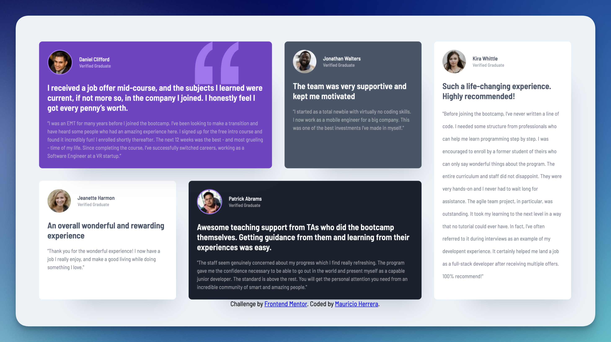

# Frontend Mentor - Testimonials grid section solution

This is a solution to the [Testimonials grid section challenge on Frontend Mentor](https://www.frontendmentor.io/challenges/testimonials-grid-section-Nnw6J7Un7). Frontend Mentor challenges help you improve your coding skills by building realistic projects. 

## Table of contents

- [Overview](#overview)
  - [The challenge](#the-challenge)
  - [Screenshot](#screenshot)
  - [Links](#links)
- [My process](#my-process)
  - [Built with](#built-with)
  - [What I learned](#what-i-learned)
  - [Continued development](#continued-development)

**Note: Delete this note and update the table of contents based on what sections you keep.**

## Overview

### The challenge

Users should be able to:

- View the optimal layout for the site depending on their device's screen size

### Screenshot

### Links

- Solution URL: [Add solution URL here](https://your-solution-url.com)
- Live Site URL: [Add live site URL here](https://newspaceracer.github.io/cautious-guacamole/)

## My process

### Built with

- Semantic HTML5 markup
- CUBE CSS (at least I tried)
- Flexbox
- CSS Grid

### What I learned

- position: relative Creates a Local Stacking Context with z-index:

- When you assign a z-index to an element, its position property must be set to relative, absolute, or fixed for the z-index to apply.
Without a valid position value, the z-index has no effect.
Stacking Contexts Influence Layering:

A stacking context isolates elements inside it. Child elements with z-index are layered relative to each other within that context, but they don't interact with elements outside the context.
A z-index value on an element without a stacking context (parent) won't influence other sibling elements properly.
When position: relative Does Not Create a Stacking Context:

position: relative alone does not create a stacking context unless the element also has a z-index value other than auto.
However, child elements within it can use their own z-index values relative to their parent.

- being unfamiliar with .flow function I forgot that it added margins to everything except the daniel card and that you can create local variables for the margins for the flow in local areas. So once I finally found that the grid worked fine because it looked like Daniel's card was too tall. 

- I also forgot that I set up some widths and heights for the cards that were carried over to the media query and that you need to explicitly override them so when I was adjusting the grid there were some very weird spacing issues that happened until I made max-width: none, and then it worked out as you expect with the cards being as wide as the columns as you move the viewport. 

- Hardest issue was to get the proportions right without using absolute fixed values which is not very easy to do, you just have to eye-ball it in a way, maybe there's better ways of doing that. I had to adjust Kira's line height manually as it was stopping way too high up from the bottom of the card. It's not scalable for if it had to be scalable I probably would just have left it be. 

